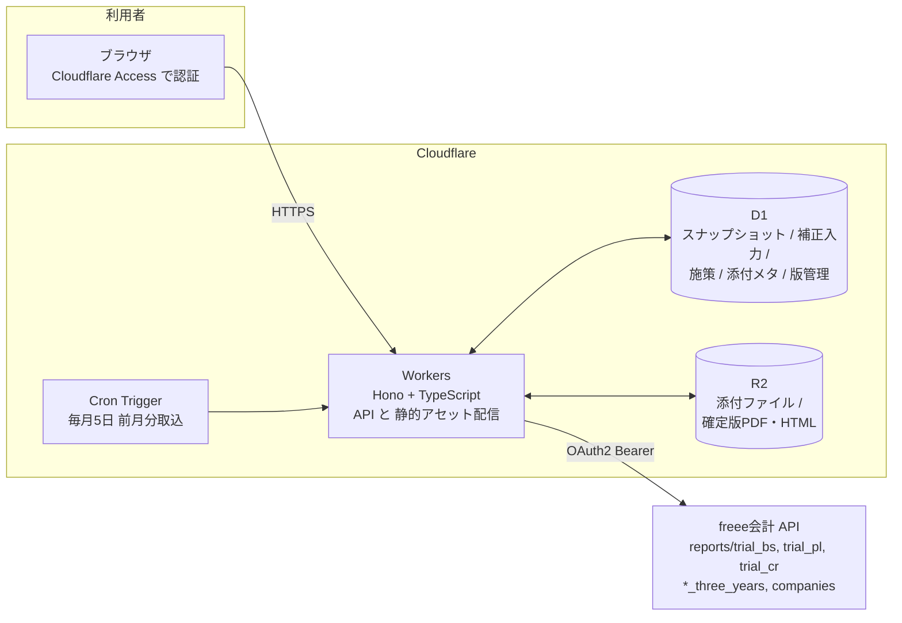
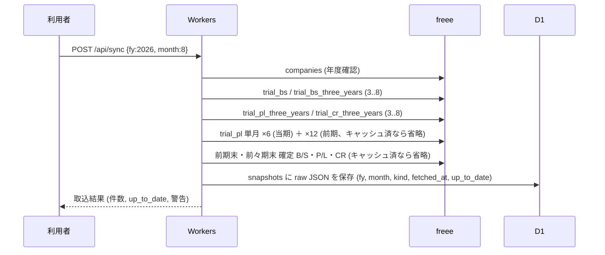

# 設計図：悠三堂 銀行提出用 月次試算表アプリ（仮称「shisan」）

作成日: 2026-09-27
版: v0.1（初版・レビュー待ち）
対象: 株式会社悠三堂（freee 事業所ID 796362、決算期 3月1日〜翌2月末日）

---

## 0. 一枚要約

freee会計の試算表API（B/S・P/L・製造原価報告書、3期比較）からデータを取り込み、
**「月末棚卸未実施」を補正した銀行提出用の月次試算表パッケージ**（PDF/画面）を
ボタン一つで作るWebアプリ。Cloudflare Workers + D1 + R2 で構築し、
既存アプリ（kiroku、yusando-gallery 等）と同じ運用基盤に乗せる。

パッケージには次を含む。

1. 作成基準（期間・出典・棚卸補正の方法と金額を明記）
2. 残高試算表（B/S）：当月末 / 前期末 / 前々期末、増減
3. 損益計算書（P/L）累計：当期 / 前期同期 / 前々期同期、増減額・増減率
4. 製造原価報告書（CR）累計：同上
5. 月次推移表（売上・粗利・営業利益・経常利益）
6. 棚卸補正ブリッジ（freee値 → 補正 → 補正後、根拠付き）
7. 借入金・役員借入金の明細
8. 当期施策一覧 と 事業計画書などの添付資料
9. 過去2期の決算サマリー

---

## 1. 背景と課題（freee実データで確認済み）

2026-09-27 に freee API で確認した事実。数値は付録Aに記載。

### 1.1 決算期と当期

- 決算期: **3月1日〜翌2月末日**。freee API の `fiscal_year` は **期首の年**（例: `fiscal_year=2026` → 2026/3〜2027/2）。
- 前期 = FY2025（2025/3〜2026/2、決算確定済み）。前々期 = FY2024（2024/3〜2025/2）。
- 当期 = FY2026。本日時点で 3〜8月が締まっている（9月は月中）。

### 1.2 棚卸の問題（本アプリの核心）

悠三堂は製造業テンプレート（製造原価報告書あり）で、棚卸資産は **製品・仕掛品（荒茶など）・原材料** の3区分。

freee では 3/1 に「期首棚卸」振替仕訳が入り、期首の在庫が **全額いったん費用計上** される。
一方「期末棚卸」振替は 2月末の決算時にしか入らないため、期中の試算表は次の状態になる。

| 区分 | 期首（費用側に計上済） | 期末（本来は控除） | 期中試算表での扱い |
|---|---:|---:|---|
| 期首製品棚卸高 | 368,295 | 0 | 費用のまま |
| [製]期首仕掛品 | 4,675,808 | 0 | 費用のまま |
| [製]期首材料棚卸高 | 139,886 | 0 | 費用のまま |
| **合計** | **5,183,989** | **0** | **約518万円だけ利益が過小** |

結果、当期3〜8月累計の当期純損益は freee 上 **▲2,092,371 円** だが、
これは在庫518万円分を全部費用にした数字であり、実態を表していない。
銀行に出すには **月末棚卸高の合理的な見積り** を織り込む必要がある。

### 1.3 付随して見つかった論点

- **B/S棚卸資産の残置差額**: B/S の製品 63,967 / 原材料 96,415 / 仕掛品 771,584（計 931,966）は、
  期首振替で戻されず期中も常に残っている。前期末B/Sの棚卸資産（6,115,955）と
  P/L側の期末棚卸（5,183,989）の差額に一致する。過去の処理差と思われ、**税理士に確認が必要**（設計上は「残置額」として別建て表示）。
- **減価償却費が年1回**: 前期 394,604 円が決算時のみ計上。期中の月次には入っていない。月割補正（32,884円/月）をオプションで用意する。
- **部門（sections）は使えない**: 36件登録があるが費目タグ的な使われ方で、セグメント損益には使えない。売上区分は勘定科目（小売売上高 / 売上高(卸) / 海外売上高 / EC売上高）で足りる。
- **freee申告APIはこのアプリ連携では未許可**: 過去の決算書PDFはAPIから取れない。過去2期の数値は freee 試算表API（決算確定済み年度）から取る。
- **債務超過・役員借入金**: 純資産 ▲1,366万円、役員借入金 1,294万円（2026/8末）。銀行は役員借入金を資本性とみなすことが多いので、明細で明示する。

---

## 2. 要件

### 2.1 機能要件（MoSCoW）

| # | 要件 | 優先 |
|---|---|---|
| F1 | freee OAuth 連携し、指定年度・月の B/S・P/L・CR と3期比較を取得して保存（スナップショット） | Must |
| F2 | 月末棚卸の補正。方法を選べ、補正額と根拠を帳票に明記 | Must |
| F3 | 前期同期・前々期同期との比較（増減額・増減率）を B/S・P/L・CR で表示 | Must |
| F4 | 前期末・前々期末（決算確定値）との B/S 比較 | Must |
| F5 | 銀行提出用PDF（A4縦、白黒印刷可）の出力 | Must |
| F6 | 当期施策の一覧（施策名・開始月・目的・関連科目・期待効果・進捗）を登録し帳票に載せる | Must |
| F7 | 事業計画書などの添付ファイル（PDF/画像/Excel）をアップロードし、パッケージに同梱 | Must |
| F8 | 月次推移表（当期各月 + 前期各月） | Should |
| F9 | 借入金・役員借入金の明細（残高はfreee、返済予定・金利・借入先は手入力） | Should |
| F10 | 減価償却費の月割補正（オプション） | Should |
| F11 | パッケージの「確定」＝スナップショット凍結・版管理・提出履歴 | Should |
| F12 | 毎月自動で前月分を取り込み、freee 集計未完了（`up_to_date=false`）なら警告 | Could |
| F13 | 資金繰り表（実績＋見込） | Could（Phase 3） |
| F14 | 銀行別テンプレ（金融機関ごとに求められる様式） | Won't（初版） |

### 2.2 非機能要件

- **正確性**: freee値と補正値を必ず分けて表示し、合計検算（借方＝貸方、B/S=P/L利益連動）を自動チェック。
- **説明可能性**: 補正は全て「方法・パラメータ・計算式・金額」を帳票の注記に自動出力。
- **秘匿性**: 財務データ。Cloudflare Access（Googleログイン、yusando.com ドメイン限定）で保護。freee トークンは Workers Secrets / D1 暗号化保存。
- **運用コスト**: 月額ほぼ0円（Workers 無料枠 + D1 + R2 数十MB）。
- **引き継ぎ性**: TypeScript 単一リポジトリ、README で 30分以内にローカル起動。
- **性能**: 1パッケージ生成に必要な freee 呼び出しは 20〜30回程度。freee レート制限（アプリ単位 3,600回/時）に十分収まる。

### 2.3 利用者と利用シーン

| 利用者 | シーン |
|---|---|
| 礒﨑（代表） | 融資相談の前日に、前月末までの試算表パッケージを作成しPDFを銀行へ送る／持参する |
| 税理士 | 補正方法と棚卸見積りの妥当性をレビュー（閲覧権限） |
| 金融機関担当 | PDF を受け取る（アプリには触れない） |

---

## 3. 全体アーキテクチャ



### 3.1 技術選定と理由

| 層 | 選定 | 理由 |
|---|---|---|
| 実行環境 | Cloudflare Workers | 既存4アプリと同一基盤。無料枠で足りる。Secrets 管理あり |
| Webフレームワーク | Hono | Workers 標準的。軽量、型付きルーティング |
| フロント | Vite + TypeScript + Preact | 画面数が少ない（6画面）。ビルドが軽く引き継ぎやすい。React 経験者ならそのまま読める |
| DB | D1 (SQLite) | 既存 gallery-db 等と同じ。JSON スナップショット保存に十分 |
| ファイル | R2 | 添付・確定PDF。既存 gallery-photos と同じ運用 |
| 認証 | Cloudflare Access（Google IdP、@yusando.com 限定） | アプリ側に認証コードを持たない。税理士は個別メール許可 |
| PDF | 初版は印刷CSS（ブラウザの「PDFに保存」） | 実装ゼロで確実。Phase 2 で Browser Rendering によるサーバ生成を検討 |
| freee 連携 | OAuth2 認可コードフロー。トークンは D1 に AES-GCM 暗号化保存（鍵は Secret） | リフレッシュトークンは使い捨てのため、取得ごとに上書き。並行更新はD1の楽観ロックで防ぐ |

---

## 4. freee データ取得設計

### 4.1 使用エンドポイント（全て GET、会計API）

| 用途 | エンドポイント | 主なパラメータ |
|---|---|---|
| 会社・年度情報 | `/api/1/companies/{id}?details=true` | `fiscal_years[]` の start/end を年度テーブルに同期 |
| 勘定科目マスタ | `/api/1/account_items` | 棚卸系科目IDの解決、カテゴリ判定 |
| B/S 当月末 | `/api/1/reports/trial_bs` | `fiscal_year, start_month=期首月, end_month=対象月, display_type=group` |
| B/S 3期比較 | `/api/1/reports/trial_bs_three_years` | 同上 → `closing / last_year / two_years_before` |
| P/L 累計 3期比較 | `/api/1/reports/trial_pl_three_years` | 同上 |
| CR 累計 3期比較 | `/api/1/reports/trial_cr_three_years` | 同上 |
| P/L 単月 | `/api/1/reports/trial_pl` | `start_month=end_month=m`（各月ぶん、当期+前期で最大24回） |
| 前期末・前々期末 確定B/S | `/api/1/reports/trial_bs` | `fiscal_year=FY-1, start_month=3, end_month=2` |
| 前期・前々期 通期 P/L・CR | `/api/1/reports/trial_pl`, `trial_cr` | 同上 |

注意点（実測）:

- `start_month`〜`end_month` は **年度をまたげない**（3〜2月は同一年度の指定として OK、1〜8月はエラー）。
- `display_type=group` 以外で `breakdown_display_type` を付けると 400。初版は `group` 固定。
- 応答の `up_to_date=false` は freee 側の集計未完了。帳票に警告を出し、確定操作を止める。
- 3期比較 API は「同一期間の累計」を返すため、**前期同期比・前々期同期比** はこの1回で取れる。

### 4.2 取り込みフロー



決算確定済み年度の応答は変わらないので D1 に永続キャッシュし、当期分だけ毎回取り直す。

---

## 5. 棚卸補正ロジック（中核仕様）

### 5.1 補正の考え方

対象月 M（期首から M までの累計）について、区分 k ∈ {製品, 仕掛品, 原材料} の **月末棚卸見積額 E_k(M)** を求め、次のように補正する。

| 帳票 | freee 値 | 補正 | 補正後 |
|---|---|---|---|
| CR 期末材料棚卸 | 0 | +E_原材料 | E_原材料（材料費から控除） |
| CR 期末仕掛品棚卸 | 0 | +E_仕掛品 | E_仕掛品（製造原価から控除） |
| P/L 期末製品棚卸 | 0 | +E_製品 | E_製品（売上原価から控除） |
| P/L 当期純損益 | X | +ΣE | X + ΣE |
| B/S 棚卸資産 | 残置額 R_k | +E_k | R_k + E_k（残置額は注記） |
| B/S 純資産（当期純損益） | X | +ΣE | 貸借一致を維持 |

補正は freee には書き戻さない（読み取り専用連携）。アプリ内の表示・帳票のみ。

### 5.2 見積方法（選択式・帳票に明記）

| 方法 | 計算 | 長所 | 短所 | 位置づけ |
|---|---|---|---|---|
| **A. 実地簡易入力法**（推奨） | 代表が月末時点の 荒茶kg・製品数量・主要材料 を入力 → 設定した単価で金額化。金額直接入力も可 | 最も実態に近く、銀行への説明力が高い | 月1回5〜10分の入力が必要 | 提出用の第一選択 |
| **B. 前期末据置法**（既定） | E_k(M) = 前期末の期末棚卸高（P/L側） | 入力不要。小規模事業の月次試算表で一般的な扱い | 季節変動（一番茶後の在庫増）を無視 | A が未入力の月の既定値 |
| **C. 原価率法**（参考） | 推定売上原価 = 当期累計売上 × 前期の売上原価率。ΣE = (期首棚卸 + 当期投入) − 推定売上原価。区分配分は前期末構成比 | 売上に連動して自動計算 | 利益率が変わる年は外れる。2026/8時点では A/B と大きく乖離 | 感応度表に併記 |

初版の既定は B。A が入力されている月は A を採用。C は常に参考値として感応度表に出す。
方法は月ごとに `adjustments.method` に記録し、帳票の注記に「採用方法・パラメータ・金額」を自動出力する。

2026/8 累計での試算（付録A の実測値から。方法差の大きさを示すため）:

| 方法 | ΣE | 補正後 当期純損益（減価償却月割前） |
|---|---:|---:|
| freee 値のまま | 0 | ▲2,092,371 |
| B. 前期末据置法 | 5,183,989 | +3,091,618 |
| C. 原価率法（前期原価率 48.6%） | 約 2,778,000 | 約 +686,000 |

差が大きいため、**銀行提出前に A（実地簡易入力）で確定させる運用** を制作予定書で前提にする。

### 5.3 その他の期中補正（オプション、既定 OFF）

| 補正 | 計算 | 備考 |
|---|---|---|
| 減価償却費 月割 | 前期実績 394,604 ÷ 12 × 経過月数（2026/8: 197,301） | 販管費に加算し利益を減らす。固定資産APIから当期見込を取れれば置換 |
| 賞与・法定福利費の引当 | 未対応 | 必要になれば手入力補正として汎用「その他補正」で対応 |

汎用「その他補正」：科目・金額・摘要を手入力し、同じブリッジ表に載せる。

### 5.4 検算ルール

1. 補正後 B/S: 資産合計 = 負債合計 + 純資産合計
2. 補正後 P/L 当期純損益 = 補正後 B/S 当期純損益金額
3. 補正後 CR 製造原価 = P/L 当期製品製造原価
4. E_k ≥ 0、かつ E_k ≤ (期首_k + 当期投入_k) を超えたら警告
5. freee `up_to_date=false` の月は「仮」ウォーターマーク

---

## 6. データモデル（D1）

```sql
-- 年度マスタ（freee companies.fiscal_years を同期）
CREATE TABLE fiscal_years (
  fy INTEGER PRIMARY KEY,          -- 2026 (= 2026/3〜2027/2)
  start_date TEXT NOT NULL,
  end_date TEXT NOT NULL,
  closed INTEGER NOT NULL DEFAULT 0 -- 決算確定なら1（手動フラグ）
);

-- freee 応答の生スナップショット
CREATE TABLE snapshots (
  id INTEGER PRIMARY KEY,
  fy INTEGER NOT NULL,
  month INTEGER NOT NULL,          -- 対象月（累計の end_month）
  kind TEXT NOT NULL,              -- bs | bs3 | pl3 | cr3 | pl_month | bs_fy_end | pl_fy | cr_fy
  params_json TEXT NOT NULL,
  body_json TEXT NOT NULL,
  up_to_date INTEGER NOT NULL,
  fetched_at TEXT NOT NULL,
  UNIQUE (fy, month, kind, params_json)
);

-- 棚卸見積の入力（方法A）
CREATE TABLE inventory_inputs (
  fy INTEGER NOT NULL, month INTEGER NOT NULL,
  category TEXT NOT NULL,          -- product | wip | material
  qty REAL, unit TEXT, unit_cost INTEGER,
  amount INTEGER NOT NULL,         -- qty*unit_cost または直接入力
  note TEXT, updated_by TEXT, updated_at TEXT,
  PRIMARY KEY (fy, month, category)
);

-- 単価マスタ（方法A用）
CREATE TABLE unit_costs (
  category TEXT NOT NULL, item TEXT NOT NULL,   -- wip/荒茶, product/紅茶50g …
  unit TEXT NOT NULL, unit_cost INTEGER NOT NULL,
  effective_from TEXT NOT NULL,
  PRIMARY KEY (category, item, effective_from)
);

-- 月ごとの補正設定と結果
CREATE TABLE adjustments (
  fy INTEGER NOT NULL, month INTEGER NOT NULL,
  method TEXT NOT NULL,            -- manual | carry_forward | cost_ratio
  depreciation_monthly INTEGER NOT NULL DEFAULT 0,
  extra_json TEXT,                 -- その他補正 [{account_item_id, amount, memo}]
  result_json TEXT,                -- 計算結果 E_k, ΣE, 検算
  PRIMARY KEY (fy, month)
);

-- 当期施策
CREATE TABLE initiatives (
  id INTEGER PRIMARY KEY,
  fy INTEGER NOT NULL,
  title TEXT NOT NULL, started_on TEXT, category TEXT,
  purpose TEXT, related_accounts TEXT, expected_effect TEXT,
  status TEXT NOT NULL DEFAULT 'active',  -- planned | active | done
  sort_order INTEGER, updated_at TEXT
);

-- 添付（R2 のメタ）
CREATE TABLE attachments (
  id INTEGER PRIMARY KEY,
  fy INTEGER NOT NULL,
  initiative_id INTEGER,           -- NULL なら年度共通（事業計画書 等）
  title TEXT NOT NULL, r2_key TEXT NOT NULL,
  content_type TEXT, size INTEGER, uploaded_at TEXT
);

-- 借入金明細（残高はfreee、他は手入力）
CREATE TABLE loans (
  id INTEGER PRIMARY KEY,
  lender TEXT NOT NULL, account_item_id INTEGER,
  principal INTEGER, rate REAL, started_on TEXT, ends_on TEXT,
  monthly_payment INTEGER, note TEXT
);

-- 提出パッケージの版
CREATE TABLE packages (
  id INTEGER PRIMARY KEY,
  fy INTEGER NOT NULL, month INTEGER NOT NULL, version INTEGER NOT NULL,
  status TEXT NOT NULL,            -- draft | final
  report_json TEXT NOT NULL,       -- 補正後の全帳票データ（凍結）
  pdf_r2_key TEXT, submitted_to TEXT, submitted_on TEXT,
  created_at TEXT NOT NULL,
  UNIQUE (fy, month, version)
);

-- freee トークン（暗号化）
CREATE TABLE oauth_tokens (
  provider TEXT PRIMARY KEY,       -- 'freee'
  enc_json TEXT NOT NULL, expires_at TEXT NOT NULL, updated_at TEXT NOT NULL
);

CREATE TABLE audit_log (
  id INTEGER PRIMARY KEY, at TEXT NOT NULL, actor TEXT, action TEXT NOT NULL, detail_json TEXT
);
```

---

## 7. API 設計（Workers / Hono）

| メソッド | パス | 内容 |
|---|---|---|
| GET | `/auth/freee/start` → `/auth/freee/callback` | OAuth 認可・トークン保存 |
| GET | `/api/periods` | 年度一覧、締め済み月、最終取込日時 |
| POST | `/api/sync` `{fy, month}` | freee 取込（§4.2） |
| GET | `/api/report/:fy/:month` | freee 値・補正・補正後を含む帳票 JSON（§8 の画面はこれだけで描く） |
| PUT | `/api/adjustments/:fy/:month` | 方法・減価償却・その他補正 |
| PUT | `/api/inventory/:fy/:month` | 実地簡易入力（3区分） |
| GET/PUT | `/api/unit-costs` | 単価マスタ |
| GET/POST/PUT/DELETE | `/api/initiatives` | 施策 CRUD |
| POST | `/api/attachments` (multipart) / GET `/api/attachments/:id` | R2 へ保存・取得 |
| GET/POST/PUT/DELETE | `/api/loans` | 借入金明細 |
| POST | `/api/packages/:fy/:month/finalize` | 版を確定（report_json 凍結、PDF は Phase 2 で生成） |
| GET | `/api/packages` | 提出履歴 |
| GET | `/print/:fy/:month?version=n` | 印刷用HTML（A4、@page 設定済み） |

`report_json` の骨格:

```json
{
  "meta": {"fy": 2026, "month": 8, "period": "2026-03-01..2026-08-31", "generated_at": "...", "up_to_date": true,
           "method": "manual", "notes": ["月末棚卸は実地簡易入力法により…", "減価償却費は前期実績の月割…"]},
  "bs":  {"rows": [{"key": "cash", "name": "現金・預金", "level": 2, "raw": 0, "adj": 0, "adjusted": 0,
                    "prev_fy_end": 0, "prev2_fy_end": 0, "diff_prev": 0, "diff_prev_pct": 0}]},
  "pl":  {"rows": [{"name": "売上高", "raw": 0, "adj": 0, "adjusted": 0, "ly": 0, "ly2": 0, "yoy": 0, "yoy_pct": 0}]},
  "cr":  {"rows": []},
  "monthly": {"months": ["2026-03", "..."], "series": {"sales": [], "gross": [], "op": [], "ordinary": []},
              "ly_series": {}},
  "bridge": {"raw_net_income": -2092371, "items": [{"label": "期末製品棚卸 見積", "amount": 0}], "adjusted_net_income": 0},
  "loans": [], "initiatives": [], "attachments": [],
  "past_fy": [{"fy": 2025, "sales": 0, "gross": 0, "op": 0, "ordinary": 0, "net": 0, "equity": 0, "inventory": 0}],
  "checks": [{"rule": "bs_balance", "ok": true}]
}
```

---

## 8. 画面設計

6画面。左ナビ + 本文。すべて日本語、数字は3桁区切り、マイナスは ▲。

```
┌ 悠三堂 試算表 ──────────────────────────────────────────────┐
│ [ダッシュボード] [取込] [棚卸補正] [施策・添付] [借入金] [提出履歴] │
├──────────────────────────────────────────────────────────────┤
│ 対象: FY2026 ▼  2026年8月 ▼   最終取込 2026-09-27 20:43  ● 集計完了  │
│                                                              │
│  売上高 13,779,723 (前期同期比 +2.9%)   補正後 経常 +3,0xx,xxx      │
│  freee値 ▲2,092,371 → 棚卸補正 +5,183,989 → 減価償却 ▲197,301     │
│                                                              │
│  [PDFを作成]  [この月を確定して提出履歴に保存]                        │
└──────────────────────────────────────────────────────────────┘
```

| 画面 | 主な要素 |
|---|---|
| ダッシュボード | 対象年月選択、主要KPI（売上・粗利・営業・経常、前期同期比）、ブリッジ要約、検算結果、PDF/確定ボタン |
| 取込 | freee 接続状態、[この月を取り込む]、取込ログ、`up_to_date` 警告、決算確定年度の再取込 |
| 棚卸補正 | 方法選択（A/B/C）、A の入力表（荒茶kg×単価 等）、減価償却月割 ON/OFF、その他補正、感応度表（A/B/C 横並び） |
| 施策・添付 | 施策一覧（並べ替え、状態）、施策ごとの添付、年度共通添付（事業計画書） |
| 借入金 | 借入先ごとの明細（freee 残高と手入力の返済条件）、役員借入金の注記文 |
| 提出履歴 | 版一覧（fy/月/版/確定日/提出先）、印刷ページへのリンク、差分表示 |

印刷用ページ `/print/:fy/:month` は独立レイアウト（ナビなし、A4 縦、ページ番号、表紙）。

---

## 9. 帳票（PDF パッケージ）仕様

| 頁 | 内容 | 出典 |
|---|---|---|
| 1 | 表紙: 会社名、対象期間、作成日、版、作成基準（棚卸補正の方法と金額、減価償却の扱い、freee 出典、集計完了フラグ） | meta |
| 2 | 残高試算表（B/S）: 科目 / 当月末（補正後）/ 前期末 / 増減 / 前々期末。棚卸資産は「見積 + 残置額」の内訳注記 | bs |
| 3 | 損益計算書（累計）: 科目 / 当期 / 前期同期 / 増減額 / 増減率 / 前々期同期 | pl |
| 4 | 製造原価報告書（累計）: 同上 | cr |
| 5 | 月次推移: 当期各月の売上・粗利・営業利益・経常利益（補正は月按分せず、累計にのみ適用と明記）＋前期同月 | monthly |
| 6 | 棚卸補正ブリッジと感応度表: freee 純損益 → 各補正 → 補正後。A/B/C の比較 | bridge |
| 7 | 借入金・役員借入金明細、純資産と役員借入金を合算した「実質純資産」の参考値 | loans, bs |
| 8 | 当期施策一覧 | initiatives |
| 9〜 | 添付資料（事業計画書 PDF は結合、画像は1枚1頁） | attachments |
| 末尾 | 過去2期決算サマリー（売上・粗利・営業・経常・純利益・純資産・棚卸資産） | past_fy |

初版は「印刷用HTML → ブラウザで PDF 保存」。添付 PDF の結合は Phase 2（Browser Rendering または pdf-lib）で実装。

---

## 10. セキュリティ・運用

- **認証**: Cloudflare Access。ポリシー「メールが @yusando.com」＋税理士の個別メール。Access の JWT をWorkersで検証し `actor` を audit_log に記録。
- **freee**: freee アプリストア「自社アプリ」として登録（読み取りスコープのみ）。Client Secret と暗号鍵は `wrangler secret`。トークン更新は D1 の `updated_at` で楽観ロック。
- **バックアップ**: D1 は `wrangler d1 export` を月次 GitHub Actions で R2 に保存。R2 はバージョニング有効。
- **ログ**: 取込・補正変更・確定・PDF出力を audit_log に残す。
- **削除**: 確定版は削除不可（status=final）。ドラフトのみ削除可。

---

## 11. リポジトリ構成（予定）

```
finance/
├─ README.md
├─ docs/                       設計・計画・引き継ぎ（本書群）
├─ wrangler.toml               Workers / D1 / R2 / Cron 設定
├─ package.json
├─ src/
│  ├─ worker/                  Hono アプリ
│  │  ├─ index.ts
│  │  ├─ routes/               auth, sync, report, adjustments, initiatives, attachments, loans, packages, print
│  │  ├─ freee/                client.ts(OAuth/呼び出し), mappers.ts(応答→内部行)
│  │  ├─ report/               assemble.ts(帳票組立), inventory.ts(補正A/B/C), checks.ts(検算)
│  │  └─ db/                   migrations/*.sql, repo.ts
│  └─ web/                     Vite + Preact 画面
│     ├─ pages/                dashboard, sync, inventory, initiatives, loans, history
│     ├─ print/                印刷レイアウト
│     └─ lib/                  format(3桁区切り・▲), api client
├─ test/                       inventory.test.ts(補正ロジック), checks.test.ts, mappers.test.ts（付録Aの実データをフィクスチャに）
└─ .github/workflows/          ci.yml(型チェック・テスト), backup.yml(D1 export → R2)
```

---

## 12. 未決事項（レビューで決めたいこと）

| # | 論点 | 選択肢 | 仮決め |
|---|---|---|---|
| Q1 | B/S 棚卸資産の残置額 931,966 の扱い | (a) 税理士に修正仕訳を依頼 (b) 帳票では「残置額」として別建て | (b) で進め、税理士に確認 |
| Q2 | 補正の既定方法 | A / B / C | B（据置）を既定、提出前に A を必須化 |
| Q3 | 減価償却月割 | 既定 ON / OFF | OFF（注記のみ）。銀行の要望で ON |
| Q4 | 単価マスタの初期値（荒茶 円/kg、製品原価） | 代表が提示 | 制作予定書 Phase 1 の準備物 |
| Q5 | PDF 生成方式 | 印刷CSS / Browser Rendering | 初版は印刷CSS |
| Q6 | 税理士のアクセス | 閲覧のみ / 補正編集可 | 閲覧のみ |
| Q7 | アプリ名・ドメイン | shisan.yusando.com 等 | 制作予定書 Phase 0 |
| Q8 | 月次推移の補正按分 | 累計のみ / 月按分 | 累計のみ（月按分は根拠が弱い） |

---

## 付録A. 2026-09-27 時点の freee 実測値（設計・テスト用フィクスチャ）

単位: 円。API 応答 `up_to_date=true`。

### A-1. 前期末（FY2025 = 2025/3〜2026/2、決算確定）

| 項目 | 金額 |
|---|---:|
| 売上高 | 26,308,383 |
| 売上原価 | 12,785,955（原価率 48.6%） |
| 売上総利益 | 13,522,428 |
| 販売管理費 | 13,420,638（うち減価償却費 394,604） |
| 営業利益 | 101,790 |
| 経常利益 | 285,902 |
| 当期純利益 | 145,902 |
| P/L 期末製品棚卸高 | 368,295 |
| CR 期末材料棚卸高 | 139,886 |
| CR 期末仕掛品 | 4,675,808 |
| B/S 製品 / 原材料 / 仕掛品 | 432,262 / 236,301 / 5,447,392 |
| B/S 資産合計 | 11,424,423 |
| B/S 長期借入金 | 8,712,730 |
| B/S 役員借入金 | 13,320,386 |
| B/S 純資産 | ▲11,663,441 |

### A-2. 当期累計（FY2026 3〜8月）と同期比較

| 項目 | 当期 3〜8月 | 前期同期 | 前々期同期 |
|---|---:|---:|---:|
| 売上高 | 13,779,723 | 13,385,886 | 11,360,108 |
| 　小売売上高 | 9,029,122 | 10,448,809 | 9,097,723 |
| 　売上高（卸等） | 2,305,508 | 755,280 | 702,791 |
| 　海外売上高 | 544,615 | 822,700 | 358,710 |
| 　EC売上高 | 1,900,478 | 1,359,097 | 1,200,884 |
| 売上原価（期末棚卸 0 のまま） | 9,475,179 | 11,091,711 | 13,256,448 |
| 　期首製品棚卸高 | 368,295 | 516,003 | 435,430 |
| 　当期製品製造原価 | 9,106,884 | 10,536,708 | 12,722,018 |
| 販売管理費 | 6,417,385 | 7,791,868 | 7,054,710 |
| 営業損益 | ▲2,112,841 | ▲5,497,693 | ▲8,951,050 |
| 当期純損益 | ▲2,092,371 | ▲5,496,125 | ▲9,038,660 |
| CR 期首材料棚卸高 | 139,886 | 130,496 | 194,235 |
| CR 当期原材料仕入高 | 595,456 | 976,646 | 1,120,202 |
| CR 製造経費 | 3,695,734 | 5,024,516 | 5,200,777 |
| CR 期首仕掛品 | 4,675,808 | 4,405,050 | 6,206,804 |
| B/S 棚卸資産（残置額のみ） | 931,966 | 931,966 | 365,670 |
| B/S 売掛金 | 3,589,980 | 2,198,484 | 1,392,779 |
| B/S 役員借入金 | 12,935,386 | 13,877,882 | 13,005,152 |
| B/S 長期借入金 | 8,712,730 | 8,816,730 | 9,002,730 |
| B/S 純資産 | ▲13,755,812 | ▲17,305,468 | ▲17,514,736 |

2026年8月単月: 売上高 3,029,245、販管費 1,023,171。

### A-3. 棚卸関連の勘定科目ID

| 科目 | ID | 区分 |
|---|---:|---|
| 製品（B/S） | 125493683 | 棚卸資産 |
| 原材料（B/S） | 125493686 | 棚卸資産 |
| 仕掛品（B/S） | 125493687 | 棚卸資産 |
| 商品（B/S） | 125493682 | 棚卸資産（未使用） |
| 期首製品棚卸高 | 234301970 | P/L |
| 期末製品棚卸高 | 234301972 | P/L |
| [製]期首材料棚卸高 | 234301973 | CR |
| [製]期末材料棚卸高 | 234301978 | CR |
| [製]期首仕掛品 | 234302013 | CR |
| [製]期末仕掛品 | 234302015 | CR |
| 減価償却費 | 125493818 | 販管費 |
| 長期借入金 | 125493754 | 固定負債 |
| 役員借入金 | 125493856 | 他流動負債 |
